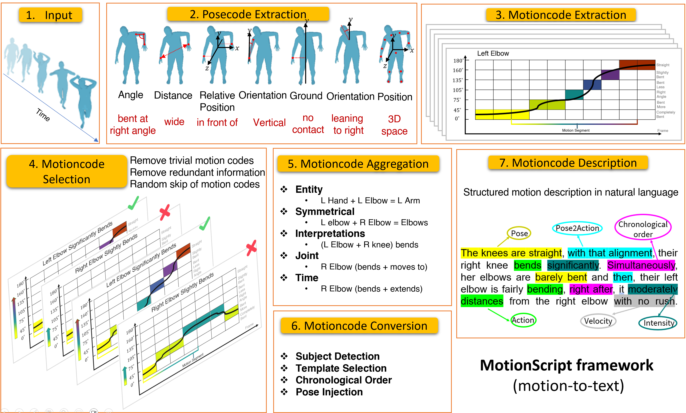

# MotionScript: Natural Language Descriptions for Expressive 3D Human Motions

This is an official PyTorch implementation of _MotionScript: Natural Language Descriptions for Expressive 3D Human Motions_. In this paper, we introduce MotionScript, a novel framework for automatically generating detailed textual captions
of human motions. MotionScript descriptions differ from existing natural language representations in that it provides detailed descriptions in natural language rather than simple action labels or generalized captions.

### [Paper](https://arxiv.org/abs/2312.12634) | [Video](https://youtu.be/olrF_Vsx6tY?si=5Rbzx07MxvCoZ4oS) | [Gallery](https://drive.google.com/drive/u/1/folders/1xsKcx7YbiPVx8LjFgMBNlT3VjrNYaSsz) | [Project Page](https://pjyazdian.github.io/MotionScript/)

## 📺 Demo Video

## Instructions

TODO

## License

This code is distributed under an [MIT LICENSE](LICENSE).

Note that our code uses datasets inluding Trinity and Talk With Hand (TWH) that each have their own respective licenses that must also be followed.

Please feel free to contact us (pjomeyaz@sfu.ca) with any question or concerns.
